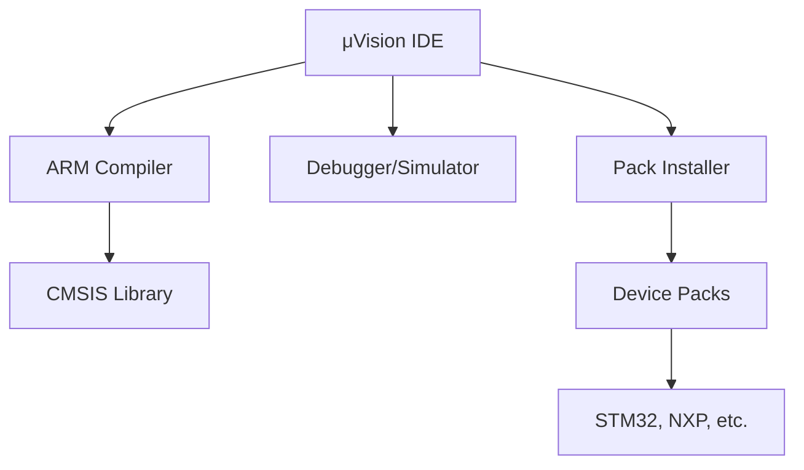
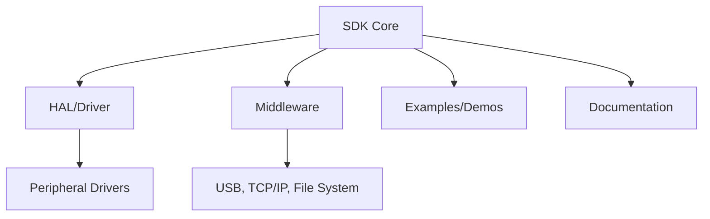
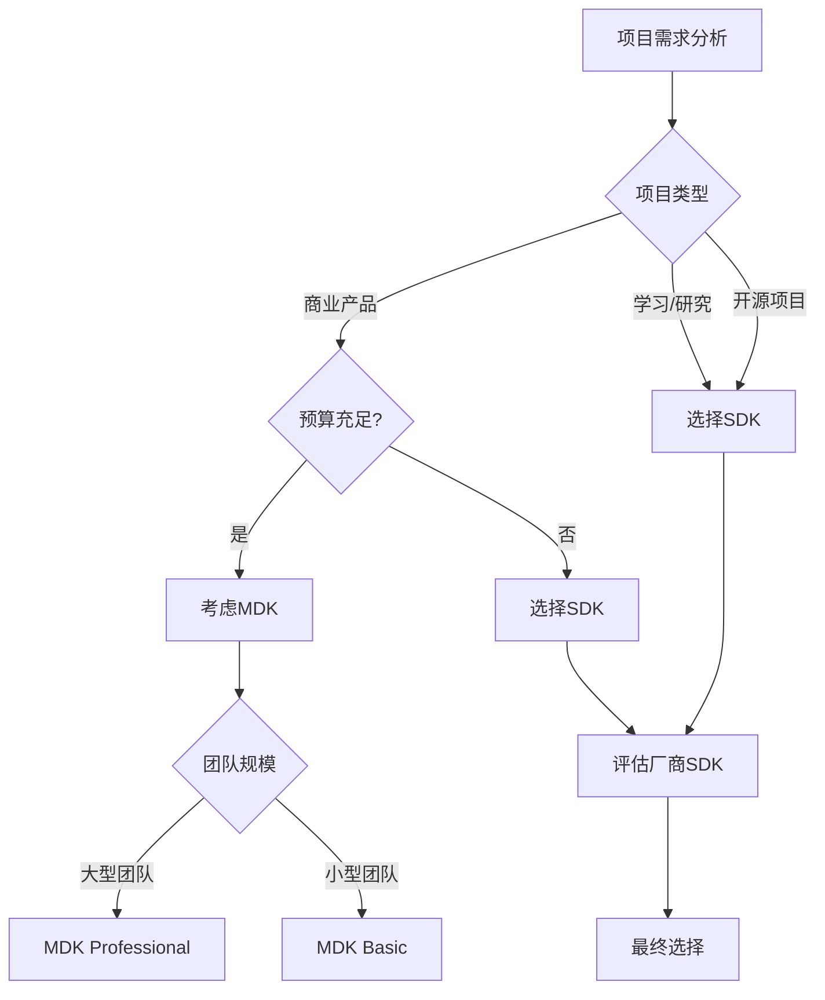

# MDK vs SDK 对比分析 ⭐⭐⭐

在嵌入式开发中，MDK和SDK是两个经常被提及但容易混淆的概念。理解它们的区别对选择合适的开发工具至关重要。

## 基本概念

### 🎯 **MDK (Microcontroller Development Kit)**
MDK是由ARM公司开发的集成开发环境，专门用于ARM Cortex-M系列微控制器的开发。

### 🛠️ **SDK (Software Development Kit)**  
SDK是软件开发工具包的通用术语，包含开发特定平台或设备所需的工具、库和文档。

## 详细对比

### 📊 **核心特性对比**

| 维度 | MDK-ARM | SDK |
|------|---------|-----|
| **全称** | Microcontroller Development Kit | Software Development Kit |
| **开发商** | ARM Keil | 各芯片厂商 |
| **目标平台** | ARM Cortex-M系列 | 特定芯片/平台 |
| **IDE集成** | Keil μVision | 多样化(Eclipse, VS Code等) |
| **编译器** | ARMCC, ARM Compiler 6 | GCC, IAR, 厂商编译器 |
| **调试器** | μVision Debugger | 多种调试工具 |
| **许可模式** | 商业许可(有限制) | 通常免费 |

### 💰 **成本分析**

#### **MDK成本**
```
MDK-ARM Essential: 免费(32KB代码限制)
MDK-ARM Basic: ~$4,500/年
MDK-ARM Plus: ~$6,000/年  
MDK-ARM Professional: ~$8,500/年
```

#### **SDK成本**
```
开源SDK: 完全免费
厂商SDK: 通常免费
第三方SDK: 按产品收费
```

### 🔧 **技术架构**

#### **MDK架构**


#### **SDK架构**  


## 实际应用场景

### 🎯 **选择MDK的场景**

#### ✅ **适合使用MDK**
- **商业项目** - 需要技术支持和稳定性保证
- **ARM生态** - 专门开发ARM Cortex-M项目
- **团队开发** - 统一的开发环境和工具链
- **复杂调试** - 需要高级调试和分析功能

```c
// MDK项目示例 - Keil项目配置
#include "stm32f4xx.h"
#include "cmsis_os.h"

// 使用CMSIS-RTOS API
osThreadId_t tid_thread1;
const osThreadAttr_t thread1_attr = {
    .stack_size = 1024
};

void app_main(void) {
    tid_thread1 = osThreadNew(thread1, NULL, &thread1_attr);
    osKernelStart();
}
```

#### ✅ **适合使用SDK**
- **学习研究** - 免费使用，适合教学和自学
- **开源项目** - 与开源生态集成
- **跨平台** - 需要支持多种芯片平台
- **定制需求** - 需要深度定制和修改

```c
// SDK项目示例 - STM32CubeMX生成代码
#include "stm32f4xx_hal.h"

// 使用HAL库
void SystemClock_Config(void) {
    RCC_OscInitTypeDef RCC_OscInitStruct = {0};
    RCC_ClkInitTypeDef RCC_ClkInitStruct = {0};
    
    HAL_RCC_OscConfig(&RCC_OscInitStruct);
    HAL_RCC_ClockConfig(&RCC_ClkInitStruct, FLASH_LATENCY_5);
}
```

### 🏭 **行业使用情况**

#### **商业产品开发**
- **大型企业**: 70%使用MDK, 20%使用厂商IDE, 10%其他
- **中小企业**: 40%使用MDK, 50%使用免费SDK, 10%其他
- **初创公司**: 20%使用MDK, 80%使用免费方案

#### **教育和研究**
- **高等院校**: 90%使用免费SDK和开源工具
- **培训机构**: 60%MDK, 40%免费方案
- **个人开发**: 95%使用免费SDK

## 工具生态对比

### 🔄 **MDK生态系统**

#### **核心组件**
- **Keil μVision** - 集成开发环境
- **ARM Compiler** - 高性能编译器
- **Pack Installer** - 器件支持包管理
- **Model Debugger** - 仿真调试环境

#### **扩展工具**
```
├── Keil Studio Cloud     (云端开发)
├── CMSIS Packs          (标准化接口)
├── RTX RTOS             (实时操作系统) 
├── Middleware           (中间件组件)
└── EventRecorder        (事件记录分析)
```

### 🌐 **SDK生态系统**

#### **主流SDK**
```
STM32Cube SDK
├── STM32CubeMX         (图形化配置)
├── STM32CubeIDE        (Eclipse集成)
├── HAL Library         (硬件抽象层)
└── Middleware Stack    (协议栈)

ESP-IDF SDK  
├── ESP-IDF Framework   (开发框架)
├── Component Manager   (组件管理)
├── Build System        (CMake构建)
└── IDF Monitor         (串口监控)

Nordic nRF SDK
├── nRF Connect SDK     (Zephyr RTOS)
├── Device Tree         (硬件描述)  
├── West Tool           (工作空间)
└── Bluetooth Stack     (蓝牙协议栈)
```

## 性能和效率对比

### ⚡ **编译性能**

| 指标 | MDK-ARM | GCC(SDK) | IAR |
|------|---------|----------|-----|
| **编译速度** | 快 | 中等 | 中等 |
| **代码优化** | 优秀 | 良好 | 优秀 |
| **代码密度** | 高 | 中等 | 高 |
| **调试信息** | 完善 | 良好 | 完善 |

### 🔧 **开发效率**

#### **MDK优势**
- ✅ **一体化环境** - 无需额外配置
- ✅ **智能提示** - 完善的代码补全
- ✅ **可视化调试** - 图形化寄存器查看
- ✅ **性能分析** - 内置性能分析工具

#### **SDK优势**  
- ✅ **灵活性高** - 可自由选择工具组合
- ✅ **社区活跃** - 丰富的开源资源
- ✅ **成本低廉** - 基本功能完全免费
- ✅ **跨平台** - 支持多种操作系统

## 迁移策略

### 🔄 **从MDK到SDK**

#### **准备工作**
1. **工具链安装** - 安装GCC ARM工具链
2. **IDE选择** - VS Code + PlatformIO 或 STM32CubeIDE
3. **项目转换** - 转换项目文件格式
4. **库替换** - 用HAL库替换Keil库

#### **迁移步骤**
```bash
# 1. 安装工具链
sudo apt-get install gcc-arm-none-eabi

# 2. 创建Makefile
CC = arm-none-eabi-gcc
CFLAGS = -mcpu=cortex-m4 -mthumb -O2
LDFLAGS = -Wl,--gc-sections

# 3. 编译项目
make all

# 4. 生成二进制文件
arm-none-eabi-objcopy -O binary main.elf main.bin
```

### 🔄 **从SDK到MDK**

#### **迁移考虑**
1. **许可证成本** - 评估商业许可费用
2. **代码兼容性** - 检查编译器兼容性
3. **团队培训** - MDK工具使用培训
4. **项目重配置** - 重新配置项目设置

## 最佳实践建议

### 🎯 **选择决策树**



### 📋 **推荐配置**

#### **入门学习**
```
推荐: STM32CubeIDE + HAL SDK
理由: 免费、完整、易上手
适合: 学生、初学者、个人项目
```

#### **商业开发**  
```
推荐: MDK-ARM + CMSIS
理由: 稳定、高效、技术支持
适合: 企业产品、关键应用
```

#### **开源项目**
```
推荐: PlatformIO + 开源SDK  
理由: 灵活、免费、社区支持
适合: 开源贡献、实验项目
```

---
*选择合适的开发工具是项目成功的第一步*