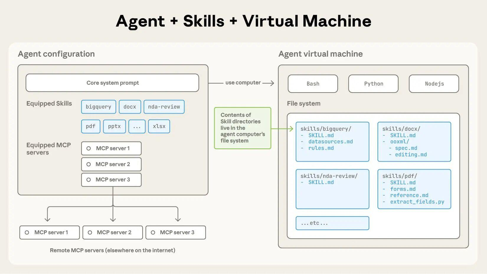
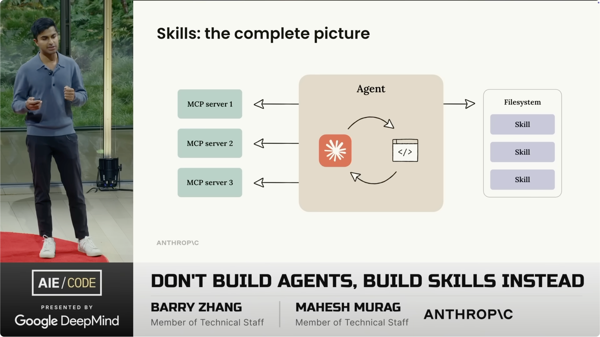
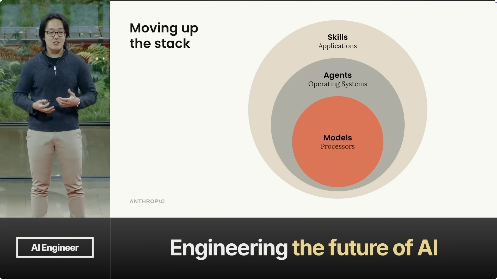

# Skill 调研报告

## 什么是Skill？

### 官方定义：

Skill 是包含指令、腳本和資源的資料夾，Claude會動態載入這些內容以提升執行專業任務的效能。技能能教導Claude以可重複的方式完成**特定任務**，無論是依據貴公司的品牌指南創建文件、運用貴組織的專屬工作流程分析數據，或是自動化個人任務皆可。

Skills are folders of instructions, scripts, and resources that Claude loads dynamically to improve performance on specialized tasks. Skills teach Claude how to complete specific tasks in a repeatable way, whether that's creating documents with your company's brand guidelines, analyzing data using your organization's specific workflows, or automating personal tasks.

> https://github.com/anthropics/skills

### 和其他 Claude capabilities的对比

#### Skills vs. Projects

[Projects](https://support.claude.com/en/articles/9517075-what-are-projects) provide static background knowledge that's always loaded when you start chats within them. Skills provide specialized procedures that activate dynamically when needed and work everywhere across Claude.

Projects 提供靜態背景知識，當您在專案內啟動對話時，這些知識會始終載入。Skills 則提供專門程序，能在需要時動態啟動，並在整個克勞德系統中無縫運作。

#### Skills vs. MCP (Model Context Protocol)

MCP connects Claude to external services and data sources. Skills provide procedural knowledge—instructions for how to complete specific tasks or workflows. You can use both together: MCP connections give Claude access to tools, while Skills teach Claude how to use those tools effectively.

MCP 將 Claude 連接到外部服務與資料來源。技能則提供程序化知識——即完成特定任務或工作流程的操作指引。兩者可協同運作：MCP 連接使 Claude 能存取各類工具，而技能則教導 Claude 如何有效運用這些工具。 

#### Skills vs. Custom Instructions

[Custom instructions](https://support.claude.com/en/articles/10185728-understanding-claude-s-personalization-features) apply broadly to all your conversations. Skills are task-specific and only load when relevant, making them better for specialized workflows.

廣泛適用於所有對話。技能則針對特定任務設計，僅在相關時載入，因此更適合專業化工作流程。

> https://support.claude.com/en/articles/12512176-what-are-skills

### 经典使用架构

https://www.youtube.com/watch?v=CEvIs9y1uog

Anthropic将Claude Skills描述为"使Claude更快、更便宜、更一致地处理重复性工作流的自定义能力"。每个Skill包含Claude执行任务所需的精确上下文，使其能够每次以相同的方式执行任务，而无需依赖详细的提示词。

## Related Videos

### Claude Agent Skills Explained

[Watch on YouTube — Claude Agent Skills Explained](https://www.youtube.com/watch?v=fOxC44g8vig)

### Don't Build Agents, Build Skills Instead – Barry Zhang & Mahesh Murag, Anthropic

[Watch on YouTube — nthropic](https://www.youtube.com/watch?v=CEvIs9y1uog)

#### Notes

其中提到使用Skill用来规范MCP工作流

	
	

## 个人理解

### 渐进式信息披露（Progressive Disclosure）

渐进式信息披露（Progressive Disclosure）是这一架构的核心，旨在解决上下文窗口的效率问题 [2]。Skills的知识加载分为三个层次：

| 披露层级 | 内容类型 | 加载时机 | 作用 |
|---------|---------|---------|------|
| 第一层 | **Metadata：**元数据（name, description） | 启动时预加载 | 让Claude知道何时应该使用每个技能 |
| 第二层 | **Instructions：**核心SKILL.md完整正文 | 判断相关时按需加载 | 提供完整的执行指令 |
| 第三层 | **Optional Resources：**附加链接文件（reference.md等） | 特定场景按需发现 | 提供深度上下文支持 |

- **Level 1 (Metadata)**: 位于 SKILL.md 顶部的 YAML Frontmatter（包含 name 和 description）是强制性的，且始终被加载到系统提示中，用于 Agent 的技能发现。这部分内容是固定的Token消耗，大约为100 Tokens [2]。

- **Level 2 (Instructions)**: SKILL.md 的主体包含程序性知识和工作流程。它只有在Claude认为相关时，才通过Agent执行 bash: read SKILL.md 命令从文件系统动态加载到上下文窗口 [2]。

- **Level 3 (Optional Resources)**: 额外的脚本（例如 .py 文件）或参考文件（例如 REFERENCE.md）只有在指令中被明确引用时，才会通过额外的 bash 命令加载或执行。尤其关键的是，当Agent执行脚本时，只有脚本的输出结果（例如“Validation passed”）被载入上下文，而脚本的代码本身不会占用上下文窗口的Tokens [2]。这种设计通过将知识检索和脚本执行从核心上下文窗口中解耦出来，实现了高效的Token管理和上下文隔离。

原文链接：https://blog.csdn.net/m0_65555479/article/details/156196539

### 个人评价

我个人认为：

Skills 是给固定流程的 **特定任務** 流程优化和减少 metadata token 数量的优化工具。

它的优势

- 便于用户编辑，易上手（甚至非技术人员）
- 可以适用的使用场景广

可能的瓶颈

- 大语言模型对于Skill这一个功能的理解能力
- 实际业务的拆解，可能需要一个对于业务逻辑和查询逻辑非常清晰的manager，将业务拆解为多重（多种）固定业务流程