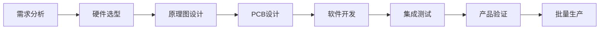

# 嵌入式系统 (Embedded Systems) ⭐

嵌入式系统是专门为特定应用设计的计算机系统，广泛应用于工业控制、消费电子、汽车电子等领域。

## 核心领域

### 🔧 **微控制器** (Microcontrollers)
- **ARM Cortex系列** - M0, M3, M4, M7架构特点
- **8位单片机** - 51系列、PIC、AVR
- **32位MCU** - STM32、ESP32、Nordic nRF系列
- **性能对比** - 处理能力、功耗、外设资源

### ⏱️ **实时系统** (Real-Time Systems)
- **实时性要求** - 硬实时、软实时系统
- **RTOS内核** - FreeRTOS、RT-Thread、μC/OS
- **任务调度** - 优先级调度、时间片轮转
- **同步机制** - 信号量、消息队列、互斥锁

### 🛠️ **开发工具** (Development Tools) ⭐
现代嵌入式开发工具生态系统的核心组成部分。

#### **MDK vs SDK 对比** ⭐⭐⭐
| 特性 | MDK (Microcontroller Development Kit) | SDK (Software Development Kit) |
|------|---------------------------------------|--------------------------------|
| **定义** | 集成开发环境 | 软件开发工具包 |
| **厂商** | ARM Keil | 各芯片厂商提供 |
| **适用范围** | ARM Cortex-M系列 | 特定芯片或平台 |
| **许可证** | 商业许可 | 通常免费 |

#### **构建系统** (Build Systems)
- **Make系统** - Makefile编写和优化
- **CMake** - 跨平台构建工具
- **芯片厂商IDE** - STM32CubeIDE、ESP-IDF
- **命令行工具** - GCC工具链、交叉编译

#### **调试工具** (Debugging Tools)
- **在线调试** - JTAG、SWD接口
- **仿真器** - J-Link、ST-Link、DAPLink
- **逻辑分析仪** - 信号时序分析
- **示波器** - 模拟信号调试

#### **跨平台开发** (Cross-Platform)
- **PlatformIO** - 统一开发平台
- **Arduino生态** - 简化开发流程
- **Zephyr RTOS** - 跨硬件平台RTOS
- **Mbed OS** - ARM官方物联网操作系统

### 🏗️ **硬件抽象层** (Hardware Abstraction Layer)
- **HAL库设计** - 统一的硬件接口
- **BSP开发** - 板级支持包
- **驱动框架** - 设备驱动模型
- **中间件** - 协议栈、文件系统

### ⚡ **低功耗设计** (Low-Power Design)
- **功耗模式** - 运行、睡眠、深度睡眠、关机
- **唤醒机制** - 外部中断、定时器、RTC
- **动态调频** - DVFS技术应用
- **能耗分析** - 功耗测量和优化

## 开发流程

### 🔄 **典型开发周期**


### 📋 **软件开发步骤**
1. **环境搭建** - 工具链安装和配置
2. **BSP适配** - 板级支持包开发
3. **驱动开发** - 外设驱动编写
4. **应用开发** - 业务逻辑实现
5. **系统集成** - 模块集成和调试
6. **性能优化** - 代码和资源优化

## 关键技术

### 🔌 **通信接口**
```c
// UART串口通信
void UART_Init(uint32_t baudrate) {
    // 配置波特率、数据位、停止位
    UART->BRR = SystemCoreClock / baudrate;
    UART->CR1 |= UART_CR1_TE | UART_CR1_RE;
    UART->CR1 |= UART_CR1_UE;
}

// SPI总线通信
void SPI_Transmit(uint8_t *data, uint16_t size) {
    while(size--) {
        while(!(SPI->SR & SPI_SR_TXE));
        SPI->DR = *data++;
    }
}

// I2C总线通信
HAL_StatusTypeDef I2C_Write(uint8_t addr, uint8_t *data, uint16_t len) {
    return HAL_I2C_Master_Transmit(&hi2c1, addr, data, len, 1000);
}
```

### ⚡ **中断处理**
```c
// 中断服务程序
void EXTI0_IRQHandler(void) {
    if(__HAL_GPIO_EXTI_GET_IT(GPIO_PIN_0)) {
        // 处理中断事件
        HAL_GPIO_TogglePin(LED_GPIO_Port, LED_Pin);
        __HAL_GPIO_EXTI_CLEAR_IT(GPIO_PIN_0);
    }
}

// 定时器中断
void TIM2_IRQHandler(void) {
    if(__HAL_TIM_GET_IT_SOURCE(&htim2, TIM_IT_UPDATE)) {
        // 定时任务处理
        __HAL_TIM_CLEAR_IT(&htim2, TIM_IT_UPDATE);
    }
}
```

## 应用领域

### 🏭 **工业控制**
- **PLC系统** - 可编程逻辑控制器
- **运动控制** - 步进电机、伺服系统
- **数据采集** - 传感器接口、ADC采样
- **人机界面** - 触摸屏、LED显示

### 🚗 **汽车电子**
- **ECU开发** - 发动机控制单元
- **AUTOSAR** - 汽车软件架构标准
- **CAN总线** - 车载网络通信
- **功能安全** - ISO 26262标准

### 🏠 **物联网**
- **无线通信** - WiFi、蓝牙、LoRa、NB-IoT
- **传感器网络** - 环境监测、智能家居
- **边缘计算** - 本地数据处理
- **云端连接** - MQTT、HTTP协议

## 学习建议

1. **基础扎实** - 掌握C语言和数字电路基础
2. **动手实践** - 从简单项目开始，逐步深入
3. **工具熟练** - 熟悉主流开发工具和调试方法  
4. **系统思维** - 理解硬件软件协同设计
5. **持续学习** - 跟踪新技术和行业标准

---
*嵌入式系统：连接物理世界与数字世界的桥梁*